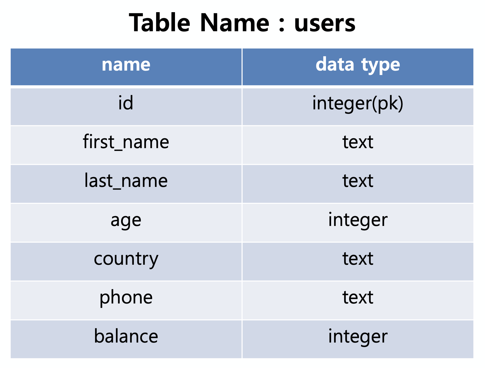

# 1. SQL & ORM

## 1. SQL ORM 비교하기



### 선행준비

- sql_orm_practice.zip 파일 다운받고

  ```python
  $ python manage.py migrate
  $ python manage.py loaddata users/users.json
  
  $ python manage.py shell_plus --print-sql
  $ User.objects.count()
  # 100개 나오는지 확인
  ```

  

1) user 테이블 전체 데이터를 조회하시오.

```sql
SELECT * FROM users_user;
```

```python
users = User.objects.all()
print(users.query)
# SELECT "users_user"."id", "users_user"."first_name", "users_user"."last_name", "users_user"."age", "users_user"."country", "users_user"."phone", "users_user"."balance" FROM "users_user"
```


2) id가 19인 사림의 age를 조회하시오.

```sql
SELECT age FROM users_user WHERE id = 19;
```

```python
# users = User.objects.filter(id=19).values('age')
User.objects.get(pk=19).age

# print(users.query)
# SELECT "users_user"."age" FROM "users_user" WHERE "users_user"."id" = 19
```


3) 모든 사람의 age를 조회하시오.

```sql
SELECT age FROM users_user;
```

```python
users = User.objects.values('age')
print(users.query)
# SELECT "users_user"."age" FROM "users_user"
```


4) age가 40 이하인 사림들의 id와 balance를 조회하시오.

```sql
SELECT id, balance FROM users_user WHERE age <= 40;
```

```python
users = User.objects.filter(age__lte = 40).values('id', 'balance')

for user in users:
  print(user.get('id'))
  print(user.get('balance'))
  
or

users = User.objects.filter(age__lte = 40)
for user in users:
  print(user.id, user.balance)
  
print(usrs.query)
# SELECT "users_user"."id", "users_user"."balance" FROM "users_user" WHERE "users_user"."age" <= 40
```


5) last_name이 ‘김’이고 balance가 500 이상인 사람들의 first_name을 조회하시오.

```sql
SELECT first_name FROM users_user WHERE last_name='김' AND balance >= 500;
```

```python
users = User.objects.filter(last_name='김', balance__gte=500).values('first_name') 
# User.objects.filter(last_name='김').filter(balance__gte=500).values('first_name')

# 보다 복잡한 쿼리나 OR는 Q 오브젝트로
# User.objects.filter(Q(last_name='김') | Q(balance__gte=500)).values('first_name')

print(users.query)
# SELECT "users_user"."first_name" FROM "users_user" WHERE ("users_user"."balance" >= 500 AND "users_user"."last_name" = 김)
```


6) first_name이 ‘수’로 끝나면서 행정구역이 경기도인 사람들의 balance를 조회하시오.

```sql
SELECT balance FROM users_user WHERE first_name LIKE '%수' AND country='경기도';
```

```python
users = User.objects.filter(first_name__endswith('수'), country='경기도').values('balance')

print(users.query)
# SELECT "users_user"."balance" FROM "users_user" WHERE ("users_user"."country" = 경기도 AND "users_user"."first_name" LIKE %수 ESCAPE '\')
```


7) balance가 2000 이상이거나 age가 40 이하인 사람의 총 인원수를 구하시오.

```sql
SELECT COUNT(*) FROM users_user WHERE balance >= 2000 OR age <= 40;
```

```python
from django.db.models import Q

User.objects.filter(Q(balance__gte=2000) | Q(age__lte=40)).count()
# 100
# SELECT COUNT(*) AS "__count" FROM "users_user" WHERE ("users_user"."balance" >= 2000 OR "users_user"."age" <= 40)

users = User.objects.filter(balance__gte=2000) | User.objects.filter(age__lte=40)
users.count()

print(users.query) # count 빠져 있는 쿼리문
# SELECT "users_user"."id", "users_user"."first_name", "users_user"."last_name", "users_user"."age", "users_user"."country", "users_user"."phone", "users_user"."balance" FROM "users_user" WHERE ("users_user"."balance" >= 2000 OR "users_user"."age" <= 40)
```


8) phone 앞자리가 ‘010’으로 시작하는 사람의 총원을 구하시오.

```sql
SELECT COUNT(*) FROM users_user WHERE phone LIKE '010%';
```

```python
User.objects.filter(phone__startswith='010').count()
# 21
# SELECT COUNT(*) AS "__count" FROM "users_user" WHERE "users_user"."phone" LIKE '010%' ESCAPE '\'
```


9) 이름이 ‘김옥자’인 사람의 행정구역을 경기도로 수정하시오.

```sql
UPDATE users_user SET country='경기도' WHERE first_name='옥자' AND list_name='김'
```

```python
User.objects.filter(first_name='옥자', last_name='김').update(country='경기도')

User.objects.filter(first_name='옥자', last_name='김')[0].country
User.objects.get(first_name='옥자', last_name='김').country
```


10) 이름이 ‘백진호’인 사람을 삭제하시오.

```sql
DELETE FROM users_user WHERE first_name='진호' AND last_name='백';
SELECT * FROM users_user WHERE first_name='진호' AND last_name='백';
```

```python
User.objects.filter(first_name='진호', last_name='백').delete()
# User.objects.get(first_name='진호', last_name='백').delete()

# (1, {'users.User': 1})
# DELETE FROM "users_user" WHERE "users_user"."id" IN (27)
```


11) balance를 기준으로 상위 4명의 first_name, last_name, balance를 조회하시오.

```sql
SELECT first_name, last_name, balance FROM users_user ORDER BY balance DESC LIMIT 4;
```

```python
users = User.objects.order_by('-balance').values('first_name', 'last_name', 'balance')[:-4]
for user in users:
  print(user.get('last_name'))
  print(user.get('first_name'))
  print(user.get('balance'))
  print('-----------')
```


12) phone에 ‘123’을 포함하고 age가 30미만인 정보를 조회하시오.

```sql
SELECT * FROM users_user WHERE phone LIKE '%123%' AND age < 30;
```

```python
users = User.objects.filter(phone__contains='123', age__lte=30)

print(users.query)
# SELECT "users_user"."id", "users_user"."first_name", "users_user"."last_name", "users_user"."age", "users_user"."country", "users_user"."phone", "users_user"."balance" FROM "users_user" WHERE ("users_user"."age" < 30 AND "users_user"."phone" LIKE %123% ESCAPE '\')
```


13) phone이 ‘010’으로 시작하는 사람들의 행정 구역을 중복 없이 조회하시오.

```sql
SELECT DISTINCT country FROM users_user WHERE phone LIKE '010%';
```

```python
users = User.objects.filter(phone__startswith='010').values('country').distinct()

print(users.query)
# SELECT DISTINCT "users_user"."country" FROM "users_user" WHERE "users_user"."phone" LIKE 010% ESCAPE '\'
```


14) 모든 인원의 평균 age를 구하시오.

```sql
SELECT AVG(age) FROM users.user;
```

```python
from django.db.models import Avg

User.objects.aggregate(Avg(age))
# {'age__avg': 28.343434343434343}
# SELECT AVG("users_user"."age") AS "age__avg" FROM "users_user"
```


15) 박씨의 평균 balance를 구하시오.

```sql
SELECT AVG(balance) FROM users_user WHERE last_name='박';
```

```python
User.objects.filter(last_name='박').aggregate(Avg('balance'))
# {'balance__avg': 196114.2857142857}
# SELECT AVG("users_user"."balance") AS "balance__avg" FROM "users_user" WHERE "users_user"."last_name" = '박'
```


16) 경상북도에 사는 사람 중 가장 많은 balance의 액수를 구하시오.

```sql
SELECT MAX(balance) FROM users_user WHERE country = '경상북도'
```

```python
from django.db.models import Max # 안해도 되던데

User.objects.filter(country='경상북도').aggregate(Max('balance'))
# {'balance__max': 400000}
# SELECT MAX("users_user"."balance") AS "balance__max" FROM "users_user" WHERE "users_user"."country" = '경상북도'
```


17) 제주특별자치도에 사는 사람 중 balance가 가장 많은 사람의 first_name을 구하시오.

```sql
SELECT first_name FROM users_user WHERE country='제주특별자치도' ORDER BY balance DESC LIMIT 1;
```

```python
User.objects.filter(country='제주특별자치도').order_by('-balance').values('first_name')[0]
# user = User.objects.filter(country='제주특별자치도').order_by('-balance').values('first_name').first()

print(user.query)
# {'first_name': '순옥'}
# SELECT "users_user"."first_name" FROM "users_user" WHERE "users_user"."country" = 제주특별자치도 ORDER BY "users_user"."balance" DESC  LIMIT 1
```

