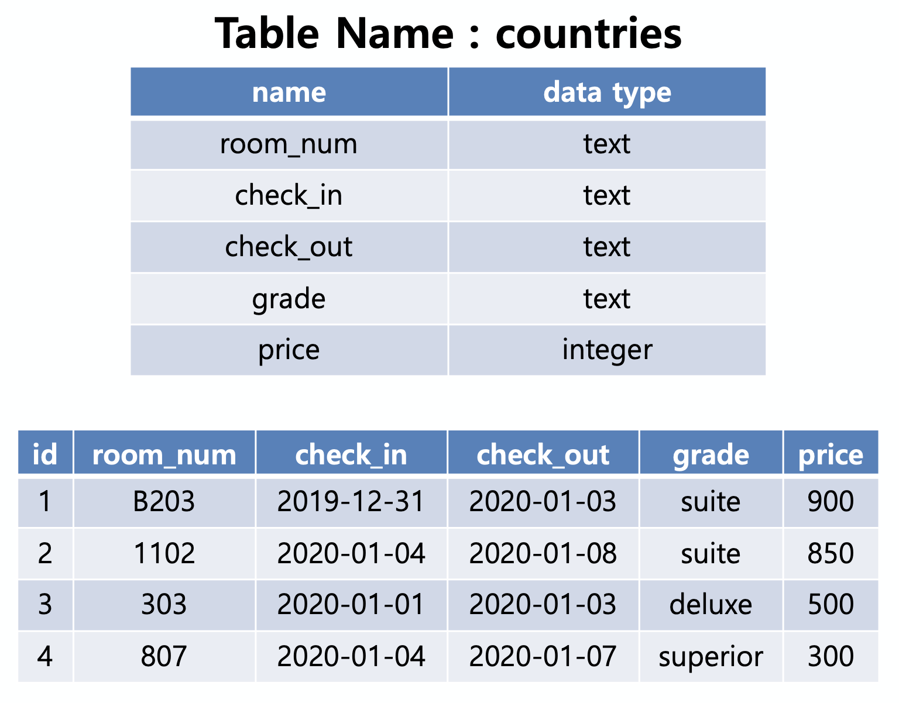

# 1. SQL & ORM

## 1. SQL query



1)  countries 테이블을 생성하시오.

```sql
CREATE TABLE countries (
	id INTEGER PRIMARY KEY AUTOINCREMENT,
  room_num TEXT NOT NULL,
  check_in TEXT NOT NULL,
  check_out TEXT NOT NULL,
  grade TEXT NOT NULL,
  price INTEGER NOT NULL
)
```


2)  데이터를 입력하시오.

```sql
INSERT INTO countries (room_num, check_in, check_out, grate, price) VALUES('B203', '2019-12-31', '2020-01-03', 'suite', 900);
INSERT INTO countries (room_num, check_in, check_out, grade, price) VALUES('1102', '2020-01-04', '2020-01-08', 'suite', 850);
INSERT INTO countries (room_num, check_in, check_out, grade, price) VALUES('303', '2020-01-04', '2020-01-03', 'deluxe', 500);
INSERT INTO countries (room_num, check_in, check_out, grade, price) VALUES('807', '2020-01-04', '2020-01-07', 'superior', 300);
```


3)  테이블의 이름을 hotels로 변경하시오.

```sql
ALTER TABLE countries RENAME TO hotels;
```


4)  객실 가격을 내림차순으로 정렬하여 상위 2개의 room_num과 price를 조회하시오.

```sql
SELECT room_num, price FROM hotels ORDER BY price DESC LIMIT 2;
```


5)  grade 별로 분류하고 분류된 grade 개수를 내림차순으로 조회하시오.

```sql
SELECT grade, COUNT(grate) FROM hotels GROUP BY grade ORDER BY COUNT(grade) DESC;
```


6)  객실의 위치가 지하 혹은 등급이 deluxe인 객실의 모든 정보를 조회하시오.

```sql
SELECT * FROM hotels WHERE (room_num LIKE 'B%') OR (grade='deluxe');
```


7)  지상층 객실이면서 2020년 1월 4일에 체크인 한 객실의 목록을 price 오름차순으로 조회하시오.

```sql
SELECT * FROM hotels WHERE (room_num NOT LIKE 'B%') AND (check_in = '2020-01-04') ORDER BY price (ASC);
```

