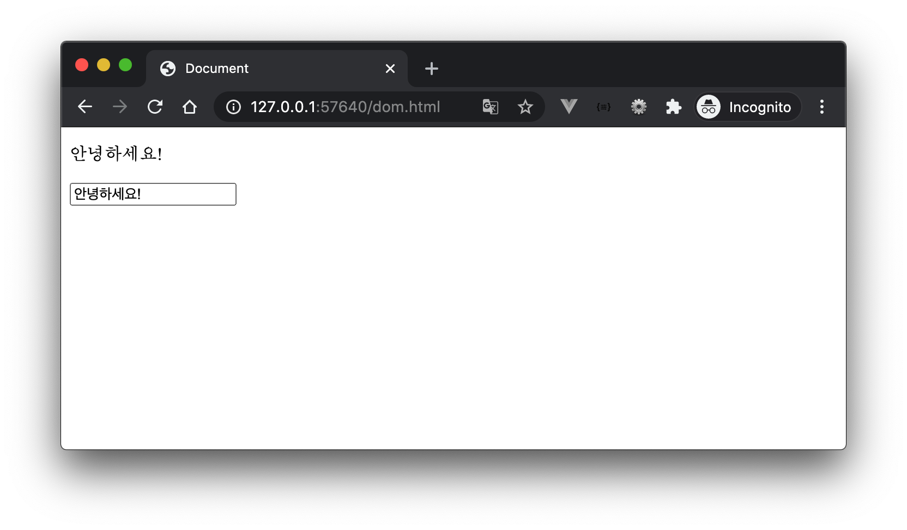

## 문제 I - 기본

>  Button을 클릭하면 `Button Clicked!`라는 메시지가 담긴 경고창이 나타나도록 코드를 작성하시오.


```html
<!DOCTYPE html>
<html lang="en">
<head>
  <meta charset="UTF-8">
  <meta name="viewport" content="width=device-width, initial-scale=1.0">
  <title>Document</title>
</head>
<body>
  <button id="myButton">Button Clicked</button>
  <script>
    const myButton = document.querySelector('#myButton')

    myButton.addEventListener('click', function () {
      console.log('버튼 클릭!')
    })
  </script>
</body>
</html>
```


## 문제 II - 스타일 속성

> Button을 클릭하면 p 태그의 텍스트를 파란색으로 변경하는 코드를 작성하시오.


```html
<!DOCTYPE html>
<html lang="en">
<head>
  <meta charset="UTF-8">
  <meta name="viewport" content="width=device-width, initial-scale=1.0">
  <title>Document</title>
</head>
<body>
  <p id="myParagraph">SSAFY 4기</p>
  <button id="myButton">파란색으로 변경하기!</button>

  <script>
    const myButton = document.querySelector('#myButton')

    myButton.addEventListener('click', function (event) {
      const myParagraph = document.querySelector('#myParagraph')
      myParagraph.style.color = 'blue'
    })
  </script>
</body>
</html>
```


## 문제 III - ClassList 조작

> Button을 클릭할 때마다 p 태그의 텍스트가 파란색 - 검은색으로 toggle되도록 코드를 작성하시오.


```html
<!DOCTYPE html>
<html lang="en">
<head>
  <meta charset="UTF-8">
  <meta name="viewport" content="width=device-width, initial-scale=1.0">
  <title>Document</title>
  <style>
    .myColor {
      color: blue;
    }
  </style>
</head>
<body>
  <p id="myParagraph">SSAFY 4기</p>
  <button id="myButton">파란색으로 변경하기!</button>

  <script>
    const myButton = document.querySelector('#myButton')

    myButton.addEventListener('click', function (event) {
      const myParagraph = document.querySelector('#myParagraph')
      /*
      // 조건 문으로도 작성 가능함을 간단하게 언급
      // (myParagraph.classList.length)
      if (myParagraph.classList.contains('myColor')) {
        myParagraph.classList.remove('myColor')
      } else {
        myParagraph.classList.add('myColor')
      }
      */
      myParagraph.classList.toggle('myColor')
    })
  </script>
</body>
</html>

```


## 문제 IV - 이벤트 객체

> input 창에 텍스트를 입력 할 때마다, p 태그 안에 해당 텍스트가 같이 입력 되도록 코드를 작성하시오.



```html
<!DOCTYPE html>
<html lang="en">
<head>
  <meta charset="UTF-8">
  <meta name="viewport" content="width=device-width, initial-scale=1.0">
  <title>Document</title>
</head>
<body>
  <p id="myParagraph"></p>
  <input type="text" id="myInput">
  <script>
    const myInput = document.querySelector('#myInput')

    myInput.addEventListener('keypress', function (event) {
      const myParagraph = document.querySelector('#myParagraph')
      myParagraph.innerText = event.target.value
    })
  </script>
</body>
</html>
```


